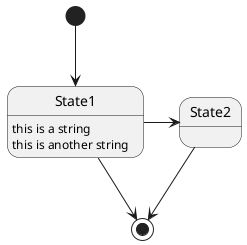

# sandbox-doc

github markdown, wiki, draw.ioなどの動作確認用

publicリポジトリ

## mermaid.js

## plantUML

PlantUML.com経由で画像化は可能  

## draw.io

<!--
通常の画像表示

通常のリンク
[draw.ioでGithubファイルを開くリンク](https://app.diagrams.net/#Hlig-noppy%2Fsandbox-doc%2Fdoc%2Fsandbox.drawio.svg)
-->

<!-- 画像表示 + draw.ioでGithub上のファイルを開くリンク(要 各自での認証連携) -->

