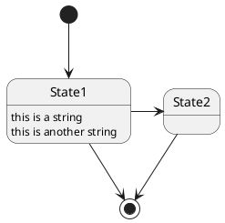

# sandbox-doc

github markdown, wiki, draw.ioなどの動作確認用

publicリポジトリ

### mermaid.js

```mermaid
graph TD;
    A-->B;
    A-->C;
    B-->D;
    C-->D;
```

### plantUML (code)

```plantuml
@startuml

[*] --> State1
State1 --> [*]
State1 : this is a string
State1 : this is another string

State1 -> State2
State2 --> [*]

@enduml
```
