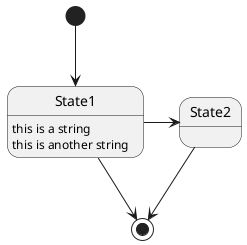

# sandbox-doc

github markdown, wiki, draw.ioなどの動作確認用

publicリポジトリ

## mermaid.js

## plantUML

PlantUML.com経由で画像化は可能  

## draw.io

### git管理課のファイルをロード

### draw.io経由でロード(現在機能していない)

https://zenn.dev/bigwheel/articles/b56feed09a3732

[draw.ioリンク](https://app.diagrams.net/#Hlig-noppy%2Fsandbox-doc%2Fdoc%2Fsandbox.drawio.svg#%7B%22pageId%22%3A%22qb4v2cUt2ur6bKFO8C9D%22%7D)

### Embed a self-editing SVG image in GitHub markdown

sandbox.drawio.svg
