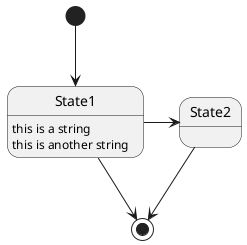

# sandbox-doc

github markdown, wiki, draw.ioなどの動作確認用

publicリポジトリ

## 図

| 項目 | Mermaid.js | PlantUML | Draw.io |
| ---- | ---- | ---- | ---- |
|表現・自由度|△|〇|◎|
|大きい図    |×|〇|◎|
|AIとの相性  |◎|〇|〇|

### Mermaid.js

❌複雑な図、要素の多い図、巨大な図になるとエラーで表示されなくなることがある

### plantUML

cli (docker等) での変換が必要。
Mermaid.jsと比べて表現力が高く、大きなファイルも生成可能。

PlantUML.com経由で画像化・表示は可能  
ただし、機密を含む図では利用すべきではない  

### draw.io

他2種と比べて自由度が非常に高い。
⚠️Mermaid.js, PlantUMLと比べるとAIとの相性(特に読み取り)は格段に落ちる(と思う)

- 読み取りトークン数がxmlで20倍、画像だとさらに大きいかも？
- XMLで読ませても自由度の高さゆえに他と比べて正確な理解をされない可能性あり

<!--
通常の画像表示

通常のリンク
[draw.ioでGithubファイルを開くリンク](https://app.diagrams.net/#Hlig-noppy%2Fsandbox-doc%2Fdoc%2Fsandbox.drawio.svg)
-->

### Figma

Embed Kitでmarkdownへの埋め込みができるらしい。
ただし、これをやるとPDF化はブラウザでやることになる。

<!-- 画像表示 + draw.ioでGithub上のファイルを開くリンク(要 各自での認証連携) -->

